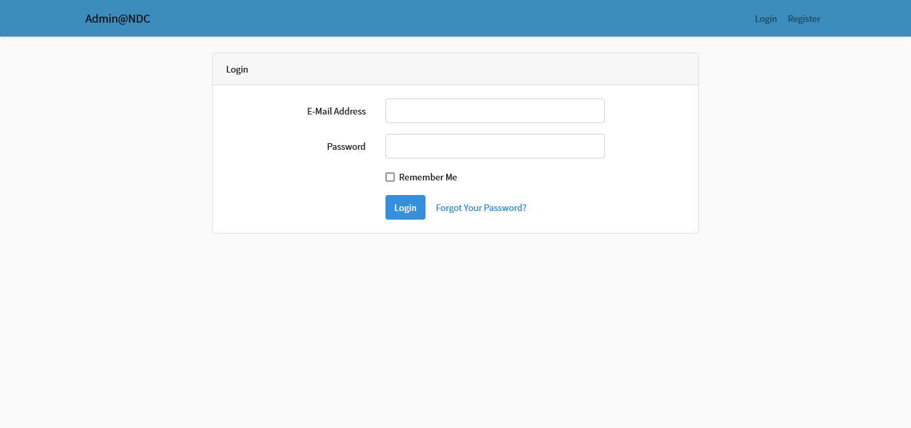
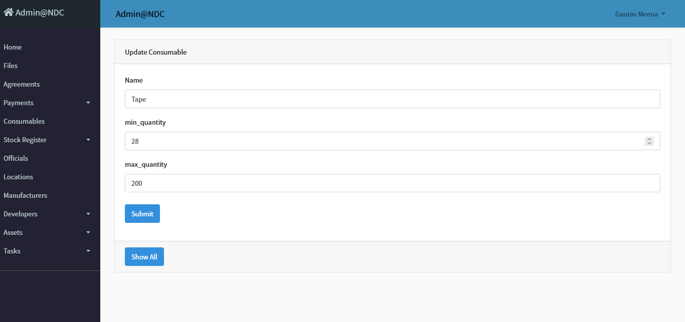
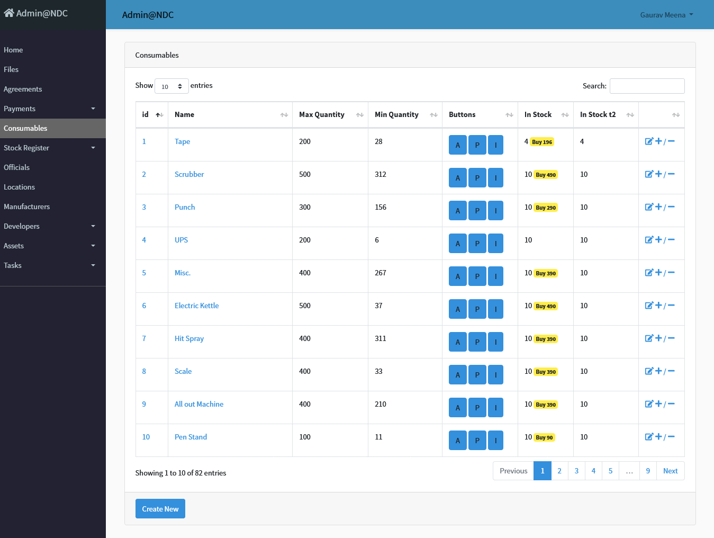
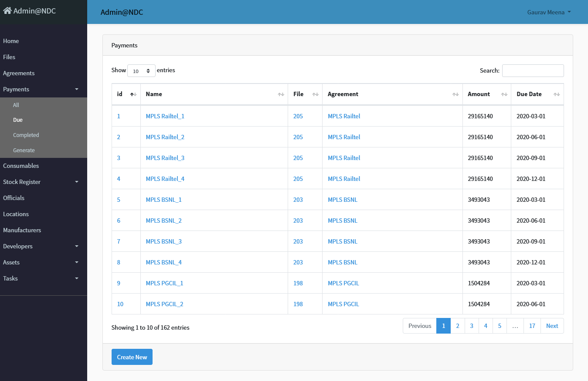
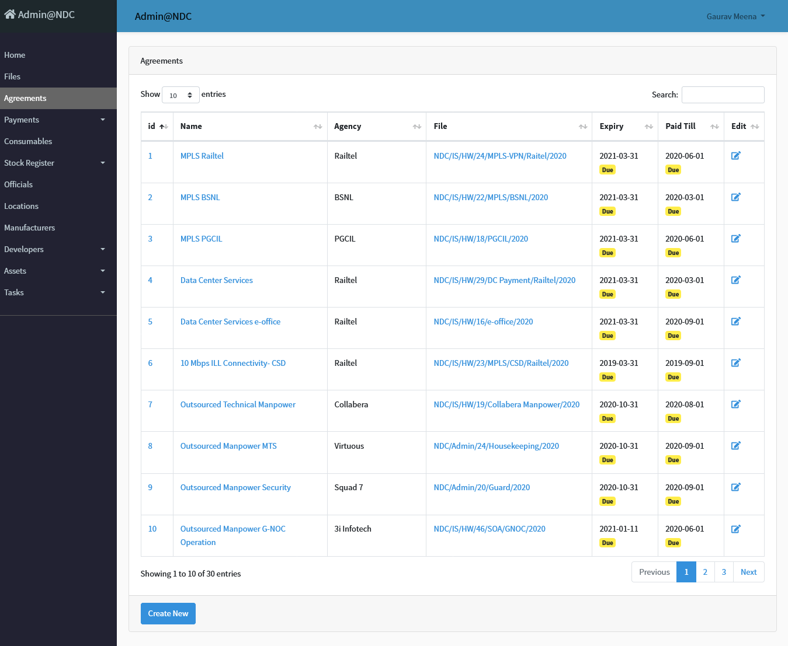
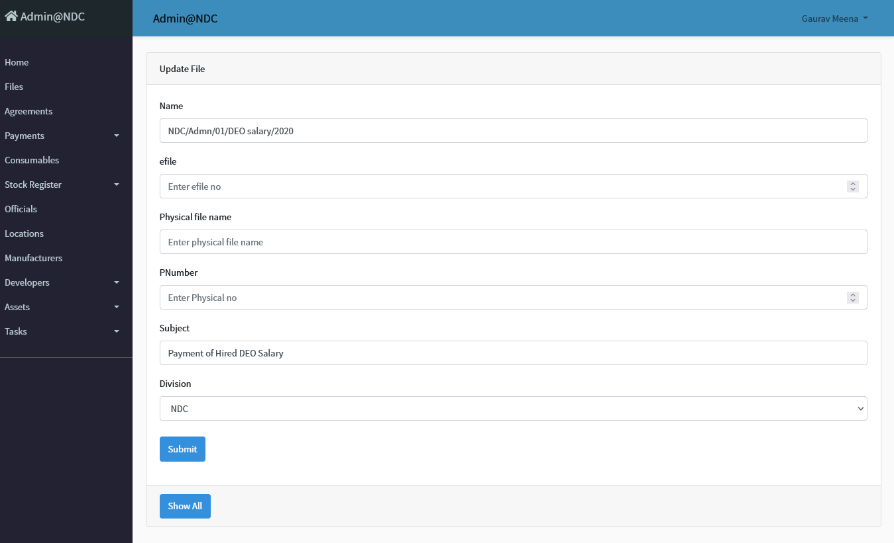
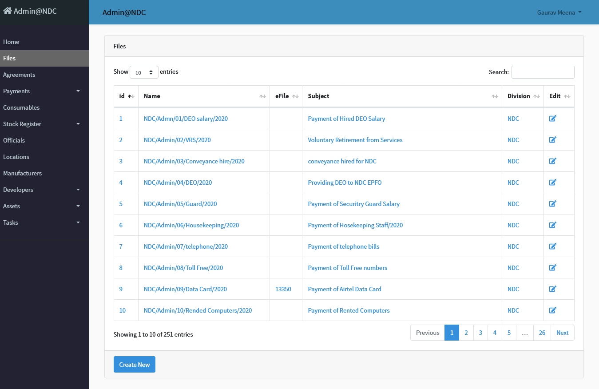
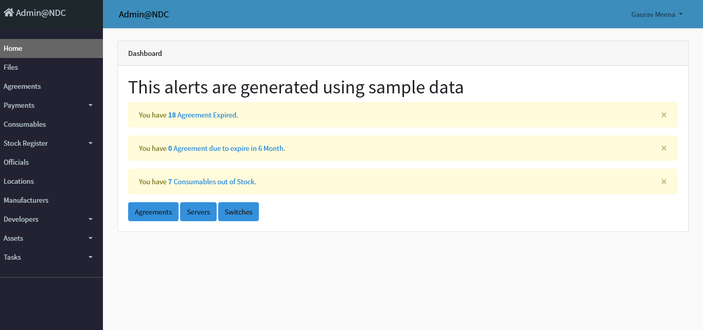

# Inventory Management Software using laravel

This software or Inventory management system including the database population and authentication system was built single handedly in 2019 using Laravel Framework of PHP.
It also uses twitter bootstrap and datatables library of javascript. 

It was built to give a demo of How Inventory can be managed inside a big office or set of offices. 

